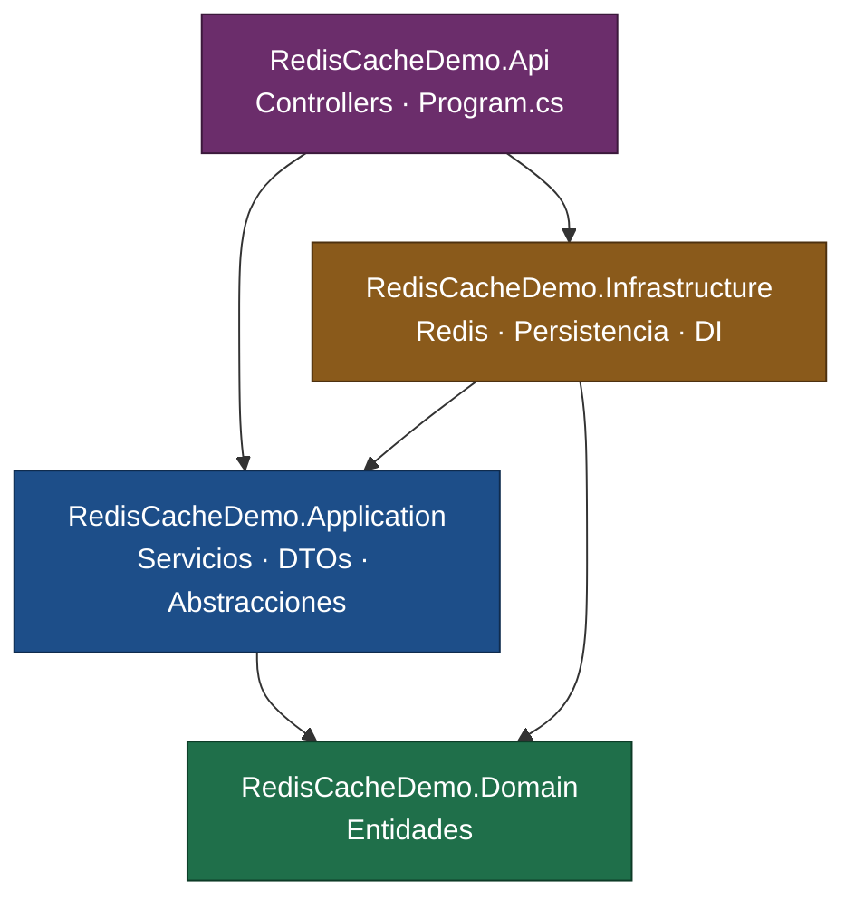

# dotnet-redis-cache-demo

API REST en .NET 8 que demuestra el uso de **Redis como distributed cache** aplicando el patrón **Cache-Aside** sobre una arquitectura por capas (Clean Architecture).

---

## 1. Descripción del proyecto

### Problema que resuelve

En una API de lectura intensiva, cada request termina golpeando el origen de datos (base de datos, servicio externo, etc.). Cuando esas lecturas son repetitivas y los datos cambian poco, el origen se convierte en el cuello de botella: latencia alta y carga innecesaria.

Una caché en memoria del proceso (`IMemoryCache`) resuelve parte del problema, pero muere con el proceso y no se comparte entre instancias: con varias réplicas detrás de un balanceador, cada una mantiene su propia copia y los datos se desincronizan.

Este proyecto implementa el caso alternativo: una **caché distribuida**, externa al proceso, compartida por todas las instancias de la aplicación.

### Rol de Redis

Redis actúa como almacén de caché externo (key-value en memoria). La aplicación:

1. Consulta Redis antes de ir al repositorio.
2. Si el dato no está, lo obtiene del origen y lo escribe en Redis con un TTL.
3. Sirve las lecturas siguientes desde Redis hasta que el TTL expira o la clave se invalida explícitamente.

Redis es infraestructura: la capa de aplicación nunca lo conoce, solo consume la abstracción `ICacheService`.

### Tecnologías

| Componente | Versión | Rol |
|---|---|---|
| .NET | 8.0 (`net8.0`) | Target framework de los cuatro proyectos |
| ASP.NET Core Web API | 8.0 | Host HTTP, controllers |
| StackExchange.Redis | 3.3.0 | Cliente Redis (`IConnectionMultiplexer`) |
| System.Text.Json | BCL | Serialización de los valores cacheados |
| Swashbuckle.AspNetCore | 6.6.2 | Swagger / OpenAPI (solo en Development) |
| Microsoft.Extensions.Options | 10.0.12 | Binding tipado de configuración (`RedisOptions`) |
| Redis | 7.x (Docker) | Servidor de caché |

---

## 2. Arquitectura

La solución sigue una separación en cuatro capas. La regla que la sostiene: **las dependencias apuntan hacia adentro**, hacia el dominio.



Equivalente en ASCII:

```
            ┌──────────────────────┐
            │         API          │
            │  (Controllers, DI)   │
            └──────┬────────┬──────┘
                   │        │
                   ▼        ▼
   ┌───────────────────┐   ┌──────────────────────┐
   │    APPLICATION    │◄──┤    INFRASTRUCTURE    │
   │ ICacheService     │   │ RedisCacheService    │
   │ IProductRepository│   │ InMemoryProductRepo  │
   │ ProductService    │   │ ServiceCollectionExt │
   └─────────┬─────────┘   └──────────┬───────────┘
             │                        │
             ▼                        ▼
            ┌──────────────────────────┐
            │          DOMAIN          │
            │     Product (entidad)    │
            │   (cero dependencias)    │
            └──────────────────────────┘
```

### Por qué Domain no depende de Infrastructure

`RedisCacheDemo.Domain` no tiene ningún `ProjectReference` ni `PackageReference` — es deliberado y verificable en su `.csproj`.

Domain modela reglas y conceptos de negocio, que son estables. Infrastructure modela decisiones técnicas, que son volátiles: hoy Redis, mañana quizá Memcached; hoy un repositorio en memoria, mañana EF Core sobre PostgreSQL. Si Domain dependiera de Infrastructure, cada cambio técnico obligaría a recompilar y potencialmente reescribir el núcleo del negocio, e invertiría la jerarquía de estabilidad: lo estable pasaría a depender de lo volátil.

Consecuencia práctica: `Product` es testeable sin Redis, sin base de datos y sin host HTTP.

### Dependency Inversion

Las capas internas **declaran** lo que necesitan; las externas lo **implementan**.

- `RedisCacheDemo.Application/Abstractions/Caching/ICacheService.cs` — Application declara qué necesita de una caché.
- `RedisCacheDemo.Infrastructure/Caching/RedisCacheService.cs` — Infrastructure lo implementa con StackExchange.Redis.
- `RedisCacheDemo.Application/Abstractions/Persistence/IProductRepository.cs` — Application declara qué necesita de la persistencia.
- `RedisCacheDemo.Infrastructure/Persistence/InMemoryProductRepository.cs` — Infrastructure lo implementa.

La interfaz vive con el consumidor, no con el implementador. Por eso la flecha de compilación va `Infrastructure → Application`, opuesta al flujo de ejecución (`Application → Infrastructure` en runtime): eso es exactamente la inversión de dependencias.

El binding concreto ocurre en un único punto, `RedisCacheDemo.Infrastructure/DependencyInjection/ServiceCollectionExtensions.cs`:

```csharp
services.AddSingleton<ICacheService, RedisCacheService>();
services.AddSingleton<IProductRepository, InMemoryProductRepository>();
services.AddScoped<IProductService, ProductService>();
```

`ProductService` nunca menciona Redis. Sustituir Redis por otro proveedor es escribir una clase nueva y cambiar una línea de registro.

---

## 3. Estructura del proyecto

```
dotnet-redis-cache-demo/
├── docker-compose.yml                  # Servicio Redis para desarrollo local
├── .env.example                        # Template de variables (sin secretos)
├── dotnet-redis-cache-demo.sln
│
├── RedisCacheDemo.Domain/              # Núcleo. Sin dependencias.
│   └── Entities/
│       └── Product.cs
│
├── RedisCacheDemo.Application/         # Casos de uso y contratos. → Domain
│   ├── Abstractions/
│   │   ├── Caching/ICacheService.cs
│   │   └── Persistence/IProductRepository.cs
│   └── Products/
│       ├── DTOs/ProductDto.cs
│       └── Services/
│           ├── IProductService.cs
│           └── ProductService.cs        # Cache-Aside vive aquí
│
├── RedisCacheDemo.Infrastructure/      # Implementaciones técnicas. → Application, Domain
│   ├── Caching/RedisCacheService.cs
│   ├── Configuration/RedisOptions.cs
│   ├── Persistence/InMemoryProductRepository.cs
│   └── DependencyInjection/ServiceCollectionExtensions.cs
│
├── RedisCacheDemo.Api/                 # Host HTTP. → Application, Infrastructure
│   ├── Controllers/
│   │   ├── ProductsController.cs
│   │   └── WeatherForecastController.cs   # Scaffold de plantilla (ver Roadmap)
│   ├── Program.cs
│   ├── appsettings.json
│   └── appsettings.Development.json
│
└── dotnet-redis-cache-demo/            # Proyecto Razor Pages inicial, sin uso (ver Roadmap)
```

| Capa | Responsabilidad | Qué **no** hace |
|---|---|---|
| **Domain** | Entidades y reglas de negocio. | No conoce persistencia, caché, HTTP ni serialización. |
| **Application** | Orquesta casos de uso, define DTOs y declara las abstracciones que consume. | No instancia nada concreto ni referencia proveedores. |
| **Infrastructure** | Implementa las abstracciones: Redis, repositorio, registro en el contenedor DI. | No contiene reglas de negocio. |
| **API** | Expone HTTP, mapea rutas y códigos de estado, compone la aplicación. | No contiene lógica de caché ni de negocio. |

> El `ProductsController` solo traduce: llama al servicio y convierte `null` en `404`. La decisión de cachear no aparece en la capa HTTP.

---

## 4. Redis

### Por qué Redis

- **Estado compartido fuera del proceso.** Varias instancias de la API ven la misma caché; un redeploy no la vacía.
- **Latencia sub-milisegundo** en operaciones `GET`/`SET` sobre datos en memoria.
- **Expiración nativa por clave.** El TTL lo gestiona el servidor; la aplicación no necesita barrer entradas vencidas.
- **Modelo de datos extensible.** Los mismos strings de hoy conviven con counters, sorted sets o Pub/Sub cuando el proyecto los necesite (ver Roadmap).

### Patrón Cache-Aside (lazy loading)

La aplicación gestiona la caché explícitamente; Redis no sabe nada del origen de datos y nunca lo consulta por su cuenta.

```
GET /api/products/1
        │
        ▼
  ¿Existe "product:1" en Redis?
        │
   ┌────┴────┐
   │ SÍ      │ NO
   ▼         ▼
CACHE HIT   CACHE MISS
   │         │
   │         ├─► Leer del repositorio
   │         ├─► ¿null? ──► 404 (no se cachea)
   │         ├─► Mapear Product → ProductDto
   │         └─► SET "product:1" TTL 10 min
   │                   │
   └─────────┬─────────┘
             ▼
        200 OK + ProductDto
```

Implementado en `RedisCacheDemo.Application/Products/Services/ProductService.cs`:

```csharp
public async Task<ProductDto?> GetByIdAsync(int id)
{
    var cacheKey = $"product:{id}";

    var cachedProduct = await _cacheService.GetAsync<ProductDto>(cacheKey);
    if (cachedProduct is not null)
    {
        return cachedProduct;          // CACHE HIT
    }

    var product = await _productRepository.GetByIdAsync(id);   // CACHE MISS
    if (product is null)
    {
        return null;
    }

    var productDto = new ProductDto(
        product.Id, product.Nombre, product.Descripcion, product.Precio);

    await _cacheService.SetAsync(cacheKey, productDto, TimeSpan.FromMinutes(10));

    return productDto;
}
```

Dos detalles de diseño:

- Se cachea el **DTO**, no la entidad. El contrato de salida es estable y se evita serializar estado de dominio.
- Un producto inexistente **no se cachea**. Es una decisión consciente: simplifica el flujo a costa de dejar la puerta abierta a *cache penetration* (peticiones repetidas de IDs inválidos que siempre golpean el origen). Mitigarlo requeriría cachear un marcador de ausencia con TTL corto.

### Cache Hit / Cache Miss

| | Hit | Miss |
|---|---|---|
| **Condición** | La clave existe y no ha expirado | La clave no existe, expiró o fue invalidada |
| **Origen de datos** | No se consulta | Se consulta |
| **Escritura en Redis** | No | Sí, con TTL |
| **Latencia** | Un round-trip a Redis | Redis + origen + escritura |

**Cómo verificarlo** (con Redis levantado):

```bash
# 1) Primer request → MISS: la clave no existía
curl http://localhost:5146/api/products/1

# 2) La clave ahora existe, con su TTL corriendo
docker compose exec redis redis-cli GET product:1
docker compose exec redis redis-cli TTL product:1      # ≈ 600 y descendiendo

# 3) Segundo request → HIT: se sirve desde Redis
curl http://localhost:5146/api/products/1
```

### TTL (Time To Live)

Cada entrada se escribe con expiración de **10 minutos**, fijada en `ProductService.GetByIdAsync` mediante `TimeSpan.FromMinutes(10)`. Al expirar, Redis elimina la clave y el siguiente request vuelve a ser un miss.

El TTL es el mecanismo que acota la ventana de datos obsoletos: sin invalidación explícita, un cambio en el origen tarda como máximo el TTL en reflejarse. Es el intercambio central del patrón — TTL alto reduce carga pero aumenta staleness; TTL bajo hace lo contrario.

> **Estado actual:** el TTL está codificado en el servicio. Externalizarlo a configuración está en el Roadmap.

### Invalidación de caché

`ICacheService.RemoveAsync(key)` borra una clave (`KeyDeleteAsync` en Redis), forzando que la siguiente lectura sea un miss y recargue del origen. Es la invalidación explícita que complementa al TTL: se ejecuta tras una escritura para que el cambio se refleje de inmediato.

> **Estado actual:** `RemoveAsync` está **implementado y probado en el contrato**, pero **no invocado**, porque el proyecto aún no expone operaciones de escritura (`POST`/`PUT`/`DELETE`). Cuando existan, el punto de invalidación es el mismo caso de uso que modifica el producto, sobre la clave `product:{id}`.

### `ICacheService` y `RedisCacheService`

**El contrato** (`RedisCacheDemo.Application/Abstractions/Caching/ICacheService.cs`) — genérico, asíncrono y sin una sola referencia a Redis:

```csharp
public interface ICacheService
{
    Task<T?> GetAsync<T>(string key);
    Task SetAsync<T>(string key, T value, TimeSpan? expiration = null);
    Task RemoveAsync(string key);
}
```

**La implementación** (`RedisCacheDemo.Infrastructure/Caching/RedisCacheService.cs`):

| Aspecto | Decisión |
|---|---|
| Conexión | Recibe `IConnectionMultiplexer` por constructor; obtiene `GetDatabase()` por operación (`IDatabase` es un handle ligero, no un recurso a mantener). |
| Serialización | `System.Text.Json` — los valores viajan como strings JSON, legibles con `redis-cli`. |
| Lectura | `StringGetAsync`; si `value.IsNullOrEmpty`, devuelve `default` → el llamador lo interpreta como miss. |
| Escritura | `StringSetAsync`; si se pasa `expiration`, la aplica como `Expiration`, si no, la clave queda sin vencimiento. |
| Borrado | `KeyDeleteAsync`. |
| Ciclo de vida | `IConnectionMultiplexer` y `ICacheService` se registran como **singleton**: el multiplexer es thread-safe, mantiene su propio pool interno y está diseñado para ser reutilizado durante toda la vida de la aplicación. Crear uno por request es el antipatrón clásico con StackExchange.Redis. |

`ProductService` depende únicamente de esta interfaz. Reemplazar Redis por otro backend no toca ni la capa de aplicación ni el dominio.

---

## 5. Requisitos

| Requisito | Versión | Notas |
|---|---|---|
| .NET SDK | **8.0 o superior** | Los proyectos apuntan a `net8.0`. Un SDK 9.x compila la solución sin cambios. |
| Redis | **7.x** | Vía Docker (recomendado) o instalación local escuchando en `6379`. |
| Docker + Docker Compose | Reciente | Solo si se levanta Redis con `docker-compose.yml`. |
| Git | — | Para clonar. |

Verificar el SDK:

```bash
dotnet --list-sdks
```

No hay base de datos que instalar: la persistencia es `InMemoryProductRepository`, con tres productos de ejemplo cargados en memoria.

---

## 6. Instalación y ejecución

```bash
# 1. Clonar
git clone https://github.com/margoar/dotnet-redis-cache-demo.git
cd dotnet-redis-cache-demo

# 2. Levantar Redis
cp .env.example .env          # Windows PowerShell: Copy-Item .env.example .env
docker compose up -d

# 3. Restaurar paquetes NuGet
dotnet restore

# 4. Compilar
dotnet build

# 5. Ejecutar la API
dotnet run --project RedisCacheDemo.Api
```

La API queda disponible en:

- HTTP: `http://localhost:5146`
- HTTPS: `https://localhost:7072`
- Swagger UI: `http://localhost:5146/swagger` (solo en `Development`)

Perfiles de arranque alternativos, definidos en `RedisCacheDemo.Api/Properties/launchSettings.json`:

```bash
dotnet run --project RedisCacheDemo.Api --launch-profile https
```

### Alternativas para levantar Redis

```bash
# Docker sin compose
docker run -d --name redis-cache-demo -p 6379:6379 redis:7-alpine

# Comprobar que responde
docker compose exec redis redis-cli ping    # → PONG
```

> La API abre la conexión a Redis durante el arranque (`ConnectionMultiplexer.Connect` en el registro del singleton). **Redis debe estar levantado antes de ejecutar la API**, o el primer request fallará al resolver el servicio.

---

## 7. Reproducibilidad del entorno

El objetivo es que clonar el repositorio y levantar el entorno sean dos comandos, sin pasos manuales ni configuración implícita.

### `docker-compose.yml`

Define un único servicio, Redis 7 Alpine, con persistencia deshabilitada (`--save "" --appendonly no`) porque una caché no necesita sobrevivir al reinicio, y con un `healthcheck` sobre `redis-cli ping`. El puerto publicado se toma de `REDIS_PORT`, con `6379` por defecto.

```bash
docker compose up -d        # levantar
docker compose ps           # estado y health
docker compose logs -f redis
docker compose down         # detener y eliminar
```

### `.env.example`

Template versionado. **Contiene solo un puerto — ningún secreto, ninguna credencial.**

```bash
REDIS_PORT=6379
```

`.env` está en `.gitignore`; `.env.example` está explícitamente exceptuado para que siga versionado. Ningún secreto real debe entrar nunca en ninguno de los dos archivos: para credenciales van User Secrets en desarrollo y variables de entorno o un gestor de secretos en producción (sección 8).

### Qué debe configurar quien clone el repositorio

| Paso | Obligatorio | Detalle |
|---|---|---|
| Copiar `.env.example` → `.env` | Solo si el puerto 6379 está ocupado | Ajustar `REDIS_PORT` y actualizar `Redis:ConnectionString` en consecuencia. |
| Instalar .NET SDK 8+ | Sí | — |
| Levantar Redis | Sí | `docker compose up -d`. |
| Editar `appsettings.json` | No | `localhost:6379` funciona tal cual con la configuración por defecto. |
| Credenciales / API keys | No | El proyecto no usa ninguna. |

Sin Redis accesible, la API compila pero falla al resolver `IConnectionMultiplexer` en el primer request.

---

## 8. Configuración

### `appsettings.json`

Configuración base, versionada, válida para desarrollo local:

```json
{
  "Logging": {
    "LogLevel": {
      "Default": "Information",
      "Microsoft.AspNetCore": "Warning"
    }
  },
  "AllowedHosts": "*",
  "Redis": {
    "ConnectionString": "localhost:6379"
  }
}
```

La sección `Redis` se enlaza a `RedisOptions` mediante el patrón Options:

```csharp
// RedisOptions.cs
public sealed class RedisOptions
{
    public const string SectionName = "Redis";
    public string ConnectionString { get; set; } = string.Empty;
}

// ServiceCollectionExtensions.cs
services.Configure<RedisOptions>(configuration.GetSection(RedisOptions.SectionName));
```

La cadena de conexión nunca se lee con strings mágicos dispersos: se resuelve en un solo lugar, tipada.

### `appsettings.Development.json`

Se aplica sobre `appsettings.json` cuando `ASPNETCORE_ENVIRONMENT=Development` (valor fijado en los tres perfiles de `launchSettings.json`). Actualmente **solo ajusta niveles de logging**; no redefine `Redis`, de modo que en desarrollo se hereda `localhost:6379`.

Swagger depende de este entorno: `Program.cs` registra `UseSwagger()`/`UseSwaggerUI()` únicamente bajo `app.Environment.IsDevelopment()`.

### Desarrollo vs. producción

| | Desarrollo | Producción |
|---|---|---|
| Origen de la config | `appsettings.json` + `appsettings.Development.json` | `appsettings.json` + variables de entorno / gestor de secretos |
| Endpoint de Redis | `localhost:6379`, sin autenticación | Host gestionado, con TLS y contraseña |
| Credenciales | Ninguna; si hicieran falta → User Secrets | Variables de entorno o Key Vault / Secrets Manager |
| Swagger | Habilitado | Deshabilitado (comportamiento actual de `Program.cs`) |

**Override por variable de entorno.** El proveedor de configuración de ASP.NET Core mapea `__` a `:`, así que la cadena de conexión se sobrescribe sin tocar ningún archivo:

```bash
# Linux / macOS
export Redis__ConnectionString="redis-prod.internal:6379,ssl=true,password=***"

# Windows PowerShell
$env:Redis__ConnectionString = "redis-prod.internal:6379,ssl=true,password=***"
```

Este es el mecanismo correcto para producción: los secretos viven en el entorno o en un gestor de secretos, nunca en el repositorio.

**User Secrets** (desarrollo, si en el futuro la conexión local requiere contraseña) — guarda valores fuera del árbol del proyecto, por lo que no pueden commitearse por accidente:

```bash
dotnet user-secrets init --project RedisCacheDemo.Api
dotnet user-secrets set "Redis:ConnectionString" "localhost:6379,password=***" --project RedisCacheDemo.Api
```

> User Secrets no está inicializado en el repositorio: la configuración actual no requiere credenciales.

---

## 9. API

Base URL: `http://localhost:5146` · Contrato interactivo en `/swagger` (Development).

### `GET /api/products/{id}`

Obtiene un producto por ID, aplicando Cache-Aside.

| | |
|---|---|
| Parámetro | `id` — entero, en la ruta (restricción `{id:int}`) |
| `200 OK` | `ProductDto` |
| `404 Not Found` | No existe producto con ese ID (sin cuerpo) |
| `400 Bad Request` | `id` no es un entero (no hay match de ruta) |

**Request**

```http
GET /api/products/1 HTTP/1.1
Host: localhost:5146
```

```bash
curl -i http://localhost:5146/api/products/1
```

**Response `200 OK`**

```json
{
  "id": 1,
  "nombre": "Teclado mecánico",
  "descripcion": "Teclado mecánico RGB",
  "precio": 59990
}
```

**Response `404 Not Found`**

```bash
curl -i http://localhost:5146/api/products/99
```

```http
HTTP/1.1 404 Not Found
```

### Datos de ejemplo

Cargados por `InMemoryProductRepository`:

| ID | Nombre | Descripción | Precio |
|---|---|---|---|
| 1 | Teclado mecánico | Teclado mecánico RGB | 59990 |
| 2 | Mouse inalámbrico | Mouse inalámbrico ergonómico | 29990 |
| 3 | Monitor 27 pulgadas | Monitor IPS 27 pulgadas | 189990 |

### Endpoints no implementados

`IProductRepository.GetAllAsync()` existe y funciona, pero **no está expuesto**: no hay `GET /api/products`. Del mismo modo, no existen operaciones de escritura, y por eso `ICacheService.RemoveAsync` aún no tiene invocador (sección 4). Ambos están en el Roadmap.

> `GET /WeatherForecast` sigue presente: es el scaffold de la plantilla `webapi` de .NET, ajeno al propósito del proyecto. Pendiente de eliminar.

---

## 10. Testing

> **Estado actual: no hay proyectos de test en la solución.** La solución contiene cuatro proyectos —`Api`, `Application`, `Domain`, `Infrastructure`— y ninguno de ellos es de pruebas. Esta sección documenta el plan, no código existente.

La arquitectura ya está preparada para pruebas: `ProductService` depende solo de `IProductRepository` e `ICacheService`, ambas interfaces, por lo que la lógica de Cache-Aside es testeable sin Redis ni host HTTP.

### Plan de pruebas

**Unit tests** — *planned*. Sin I/O, con dobles de prueba para ambas interfaces. Cubrirían el comportamiento de `ProductService`:

- Cache hit: la caché devuelve valor → el repositorio **no** se invoca.
- Cache miss: la caché devuelve `null` → se consulta el repositorio y se escribe en caché con TTL de 10 minutos.
- Producto inexistente: devuelve `null` y **no** escribe en caché.
- Formato de la clave: `product:{id}`.

**Integration tests** — *planned*. Contra un Redis real (contenedor efímero vía Testcontainers, o el servicio de `docker-compose.yml`), levantando la API con `WebApplicationFactory`. Cubrirían lo que los unit tests no pueden: serialización JSON de ida y vuelta, expiración real por TTL y los códigos de estado HTTP.

| | Unit tests | Integration tests |
|---|---|---|
| Alcance | Una clase aislada | API + Redis reales |
| Dependencias | Dobles de prueba | Contenedor Redis |
| Velocidad | Milisegundos | Segundos |
| Verifican | Lógica de decisión | Serialización, TTL, HTTP |

### Cómo se ejecutarán

Una vez añadidos los proyectos de test:

```bash
dotnet test                                  # toda la solución
dotnet test --filter Category=Unit           # solo unitarios
dotnet test --logger "console;verbosity=detailed"
```

Los tests de integración requerirán Redis levantado (`docker compose up -d`) salvo que se use Testcontainers, que gestiona su propio ciclo de vida.

---

## 11. Git

### Conventional Commits

El historial sigue [Conventional Commits](https://www.conventionalcommits.org/):

```
<tipo>: <descripción en imperativo, minúscula>
```

| Tipo | Uso |
|---|---|
| `feat` | Nueva funcionalidad |
| `fix` | Corrección de bug |
| `refactor` | Cambio interno sin alterar comportamiento |
| `docs` | Documentación |
| `test` | Pruebas |
| `chore` | Build, dependencias, configuración |

Ejemplos reales del historial:

```
feat: add products api endpoint
feat: implement product cache-aside service
feat: add product persistence abstraction
feat: wire infrastructure dependency injection
chore: add infrastructure project
```

### Estrategia de commits

Commits pequeños y verticales: cada uno introduce una pieza coherente y deja la solución compilando. El orden del historial refleja la dirección de las dependencias — primero el contrato, después la implementación, por último el endpoint que lo consume.

### Ramas

| Rama | Rol |
|---|---|
| `master` | Rama principal, estable |
| `staging` | Integración; se fusiona a `master` vía Pull Request |

> Los primeros commits del repositorio (`a202ef7`, `e670f6e`, `99b930d`, …) son anteriores a la adopción de la convención y no la siguen. Desde `4558169` el historial es consistente.

---

## 12. Roadmap

### Implementado

- [x] Arquitectura en cuatro capas con dependencias hacia el dominio
- [x] `ICacheService` como abstracción de caché en Application
- [x] `RedisCacheService` sobre StackExchange.Redis con serialización JSON
- [x] `IConnectionMultiplexer` como singleton, configurado vía `RedisOptions`
- [x] Cache-Aside en `ProductService` con TTL de 10 minutos
- [x] `GET /api/products/{id}` con `200`/`404`
- [x] `InMemoryProductRepository` con datos de ejemplo
- [x] Registro centralizado de DI (`AddInfrastructure`)
- [x] Swagger/OpenAPI en Development
- [x] `docker-compose.yml` para Redis con healthcheck
- [x] `.env.example` sin secretos

### Planned

**Completar el caso de uso**

- [ ] `GET /api/products` — exponer `GetAllAsync`, ya implementado en el repositorio
- [ ] Operaciones de escritura (`POST`/`PUT`/`DELETE`) e **invalidación explícita** vía `RemoveAsync`
- [ ] Externalizar el TTL a configuración en lugar de codificarlo en el servicio
- [ ] Logging estructurado de hit/miss por clave
- [ ] Health check de Redis en `/health`
- [ ] Manejo resiliente de la caída de Redis: degradar al origen en vez de propagar el fallo
- [ ] Sustituir `InMemoryProductRepository` por persistencia real (EF Core)

**Pruebas**

- [ ] Proyecto de unit tests para `ProductService`
- [ ] Integration tests con Testcontainers

**Limpieza**

- [ ] Eliminar `WeatherForecastController` y `WeatherForecast.cs` (scaffold de plantilla)
- [ ] Retirar de la solución el proyecto Razor Pages `dotnet-redis-cache-demo/`, sin uso

**Otros usos de Redis** *(fuera del alcance actual)*

- [ ] **Counters** — `INCR` atómico para métricas de hit/miss y contadores de vistas
- [ ] **Rate limiting** — ventana deslizante por cliente con `INCR` + `EXPIRE`
- [ ] **Pub/Sub** — invalidación coordinada entre instancias al cambiar un producto
- [ ] **Distributed locks** — evitar *cache stampede* en la recarga de claves calientes
- [ ] Estructuras adicionales: Hashes para objetos parciales, Sorted Sets para rankings

---

## Licencia

Proyecto de demostración con fines educativos.
